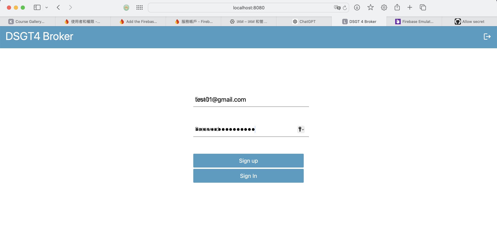
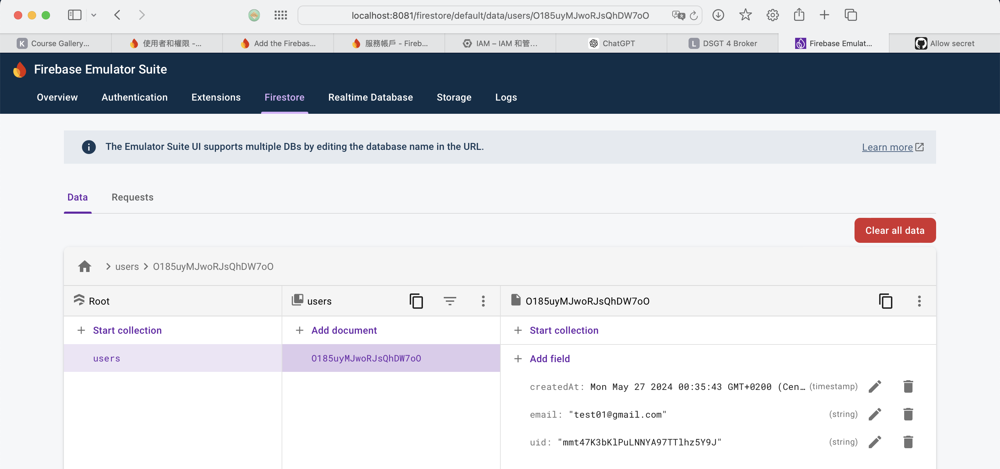

## Add firebaseadminsdk
in the src/main/java/be.kuleuven.dsgt4/auth, create a new file called
```
firebase-adminsdk.json
```
Then copy and paste the follwing to this json file
```
The content is in our Whatsapp
```

## Setup and Execution
### Step 1: Run the Emulator Locally
    ./firebase-tools-linux emulators:start

    or

    firebase emulators:start

To change it to use the cloud, please change the index.js and the WebSecurityConfig
### Step 2: Start Spring application
    mvn spring-boot:run

### Step 3: Access the Application and Sign Up
  http://localhost:8080
  

### Step 4: Access the Firestore Emulator Firestore (database monitor)
  http://localhost:8081/firestore
  

### 3.1.1 REST Controller and WebClient
- **REST Controller**: Verify the REST controller included in the sample project is functioning as intended.
- **WebClient Development**: The WebClient component is missing and needs to be developed to interact with web services.

### 3.1.2 Web Security Configuration
- **Search for Configuration**: In the sample project, look for the following imports, which are related to web security:
  ```java
  import org.springframework.security.config.annotation.web.builders.HttpSecurity;
  import org.springframework.security.config.annotation.web.configuration.EnableWebSecurity;
  ```
- **Current Configuration**: The "auth.WebSecurityConfig" and "SecurityFilter" in the sample code use a configuration that includes deprecated APIs.
- **Adaptation Strategy**: Update the security configuration by:
  1. Analyzing how Professor Bert configured the project.
  2. Reviewing how the sample project implemented these configurations.
  3. Developing our version based on the above findings.

### 3.1.3 Security Filter Comparison
- **Security Filter Analysis**: Compare the "SecurityFilter" implementation in our sample code, particularly looking at "JwtAuthenticationFilter", to identify similarities and differences.

### 3.1.4 Data Repository Integration
- **Repository Implementation**: The sample project uses a Spring Framework data repository.
- **Modification Requirement**: Modify the existing data repository implementation to utilize Firestore, aligning it with the project provided by Professor Bert.

This structured breakdown provides a clearer roadmap for your project tasks, focusing on what needs to be checked, developed, or adapted in your software development effort.
